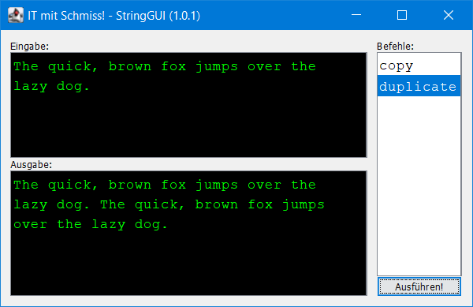

# IT mit Schmiss – String Command GUI

## Download und Installation

Dies ist ein BlueJ-Projekt. Ladet die aktuelle Version von GitHub als ZIP-Archiv, dann entpackt es in Eurem Informatik-Ordner auf dem PC und öffnet den Ordner normal in BlueJ.

Euren eigenen Befehle schreibt Ihr in `StringBefehle`; das Hauptprogramm `StringGUI` findet diese dann selbständig und bindet sie ein.
Startet das Programm am Schnellsten mit `StringGUI` → runMe().

In dieser rohen Version gibt es zwei Befehle `copy`, der noch _nicht_ funktioniert und `duplicate`, der den Eingabetext doppelt auf dem Bildschirm ausgibt.

Wichtig ist, dass Eure Methoden einen String als Parameter bekommen und einen als Ergebnis zurückgeben (Rückgabetyp). Wenn Ihr die ZIP-Datei noch einmal ladet, achtet darauf, Eure eigenen Befehle nicht zu überschreiben.
